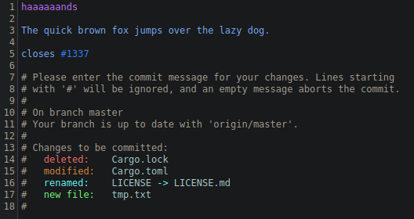

# `tree-sitter-git-commit`

A [tree-sitter](https://tree-sitter.github.io/tree-sitter/) grammar for git commit messages.

### Status

Somewhat complete but needs testing and highlight queries.

### Example

In the [Helix](https://github.com/helix-editor/helix) editor:

